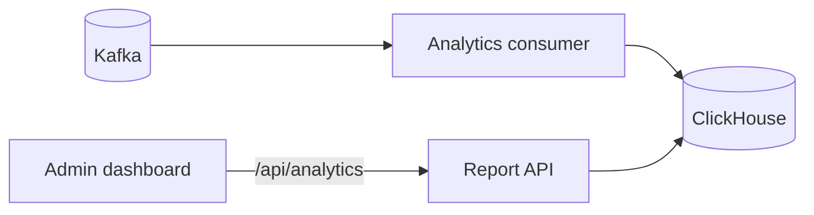
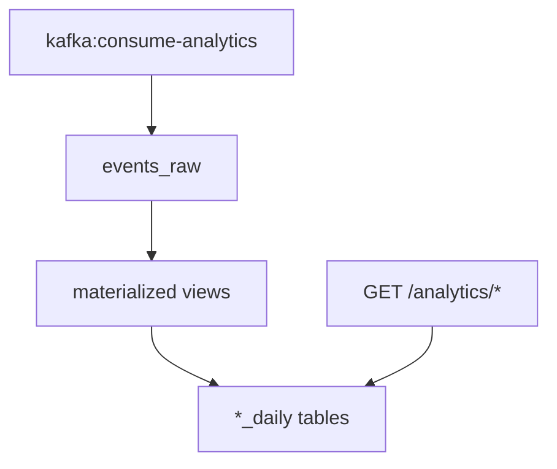
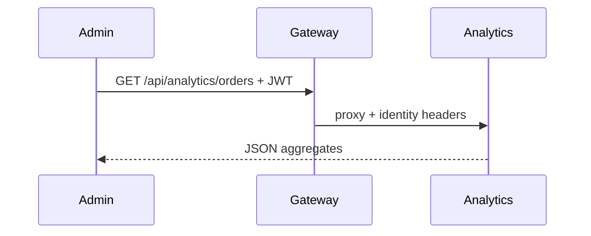
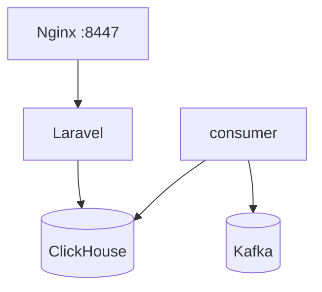

# Architecture

## Context

```mermaid
flowchart LR
  KF[(Kafka)]
  AN[Analytics consumer]
  CH[(ClickHouse)]
  API[Report API]
  AD[Admin dashboard]

  KF --> AN --> CH
  API --> CH
  AD -->|/api/analytics| API
```

## Ingest pipeline

```mermaid
flowchart TB
  C[kafka:consume-analytics] --> RAW[events_raw]
  RAW --> MV[materialized views]
  MV --> DAILY[*_daily tables]
  REST[GET /analytics/*] --> DAILY
```

## Gateway access

```mermaid
sequenceDiagram
  participant Admin
  participant Gateway
  participant Analytics

  Admin->>Gateway: GET /api/analytics/orders + JWT
  Gateway->>Analytics: proxy + identity headers
  Analytics-->>Admin: JSON aggregates
```

## Runtime

```mermaid
flowchart TB
  nginx[Nginx :8447] --> back[Laravel]
  back --> ch[(ClickHouse)]
  consumer[consumer] --> kafka[(Kafka)]
  consumer --> ch
```
