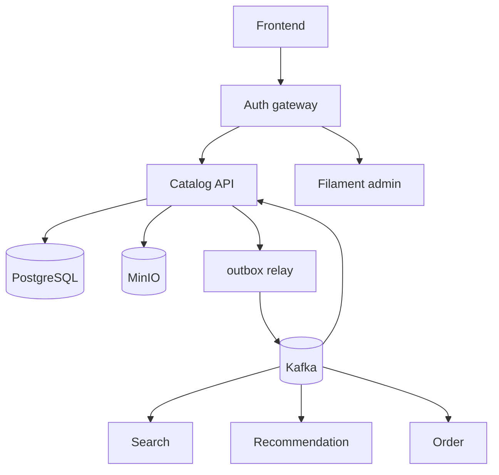
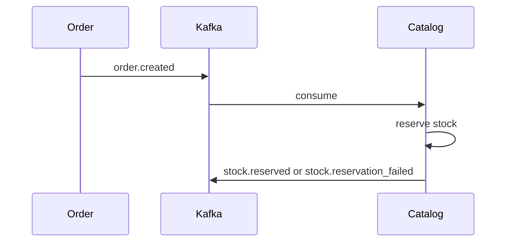
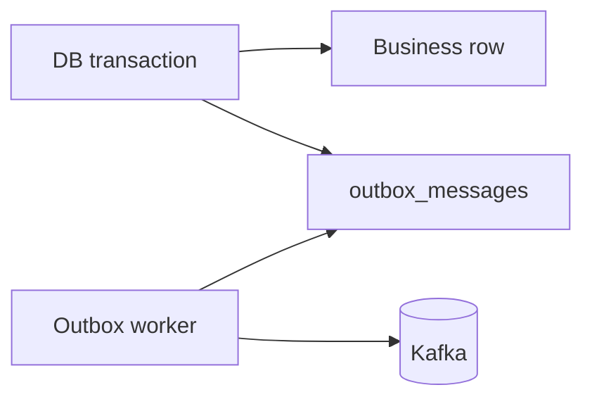
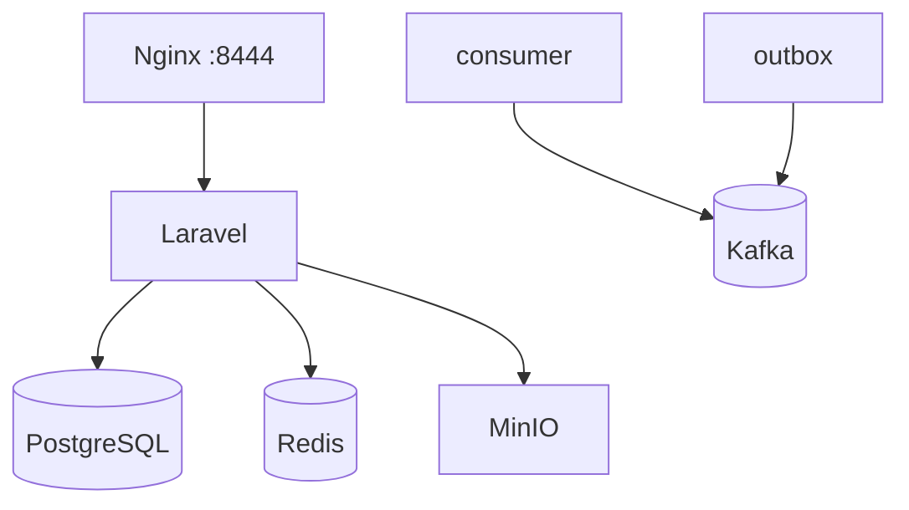

# Architecture

## Context

```mermaid
flowchart TB
  FE[Frontend] --> GW[Auth gateway]
  GW --> CAT[Catalog API]
  GW --> FIL[Filament admin]
  CAT --> PG[(PostgreSQL)]
  CAT --> MINIO[(MinIO)]
  OUT[outbox relay] --> KF[(Kafka)]
  CAT --> OUT
  KF --> SRCH[Search]
  KF --> REC[Recommendation]
  KF --> ORD[Order]
  KF --> CAT
```

## Inventory saga

```mermaid
sequenceDiagram
  participant Order
  participant Kafka
  participant Catalog

  Order->>Kafka: order.created
  Kafka->>Catalog: consume
  Catalog->>Catalog: reserve stock
  Catalog->>Kafka: stock.reserved or stock.reservation_failed
```

## Outbox pattern

```mermaid
flowchart LR
  TX[DB transaction] --> ROW[Business row]
  TX --> OB[outbox_messages]
  RELAY[Outbox worker] --> OB
  RELAY --> KF[(Kafka)]
```

## Runtime

```mermaid
flowchart TB
  nginx[Nginx :8444] --> back[Laravel]
  back --> sql[(PostgreSQL)]
  back --> redis[(Redis)]
  back --> minio[MinIO]
  consumer[consumer] --> kafka[(Kafka)]
  outbox[outbox] --> kafka
```
