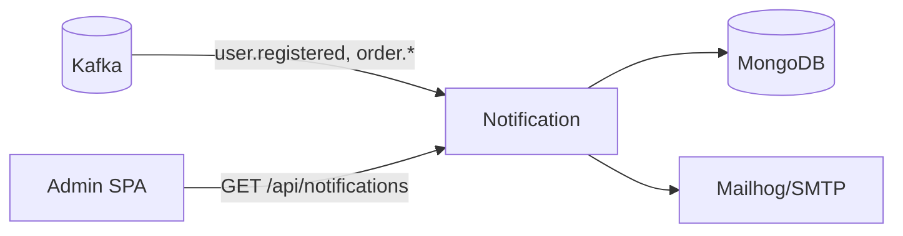
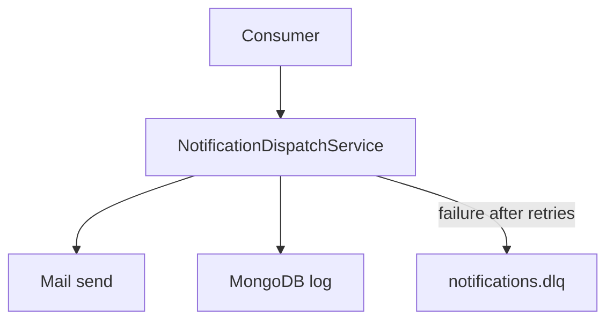
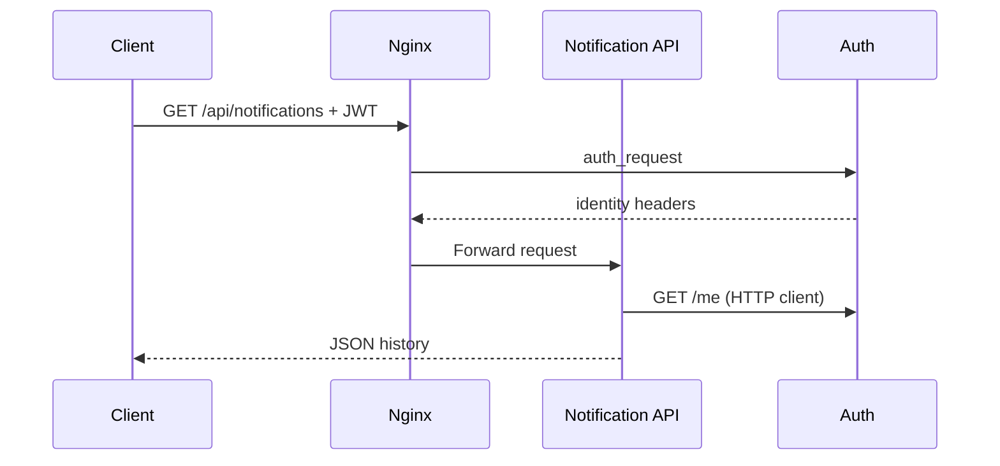
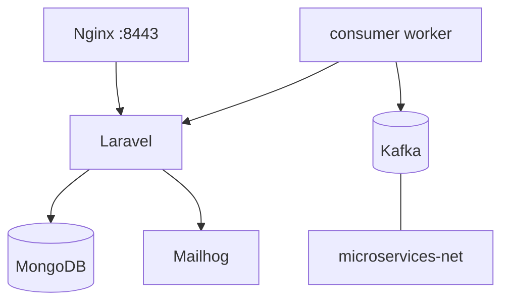

# Architecture

## Context

```mermaid
flowchart LR
  KF[(Kafka)]
  N[Notification]
  M[(MongoDB)]
  MH[Mailhog/SMTP]

  KF -->|user.registered, order.*| N
  N --> M
  N --> MH
  AD[Admin SPA] -->|GET /api/notifications| N
```

## Processing pipeline

```mermaid
flowchart TB
  C[Consumer] --> D[NotificationDispatchService]
  D --> SMTP[Mail send]
  D --> LOG[MongoDB log]
  D -->|failure after retries| DLQ[notifications.dlq]
```

## REST flow

```mermaid
sequenceDiagram
  participant Client
  participant Nginx
  participant API as Notification API
  participant Auth

  Client->>Nginx: GET /api/notifications + JWT
  Nginx->>Auth: auth_request
  Auth-->>Nginx: identity headers
  Nginx->>API: Forward request
  API->>Auth: GET /me (HTTP client)
  API-->>Client: JSON history
```

## Runtime

```mermaid
flowchart TB
  nginx[Nginx :8443] --> back[Laravel]
  back --> mongo[(MongoDB)]
  back --> mail[Mailhog]
  consumer[consumer worker] --> back
  consumer --> kafka[(Kafka)]
  kafka --- net[microservices-net]
```
