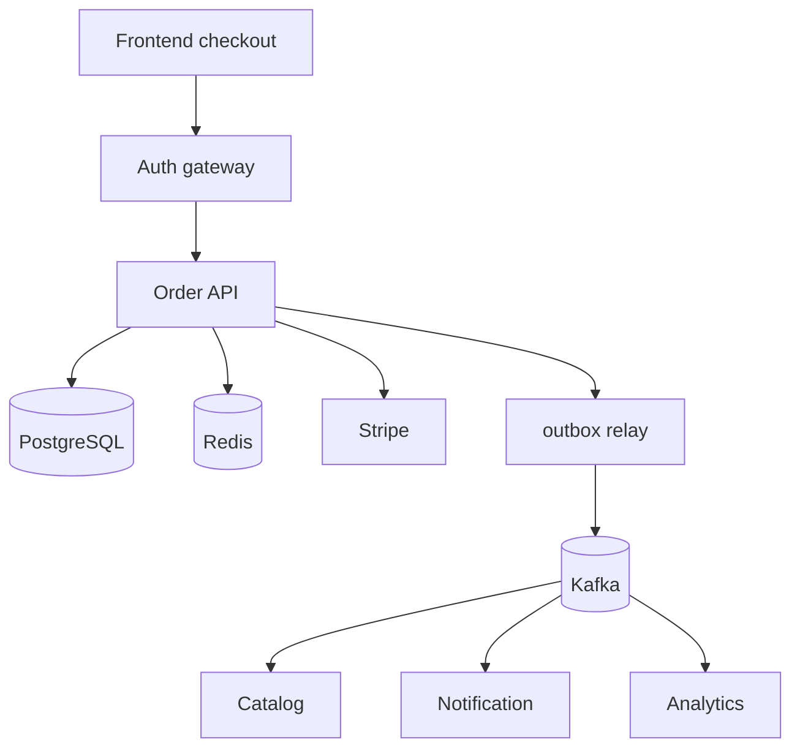
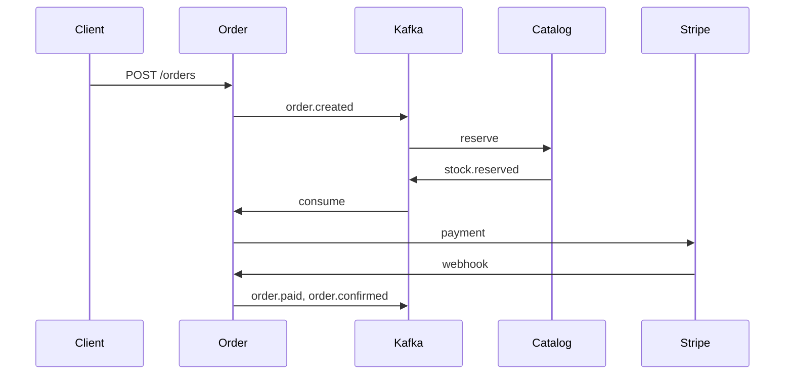
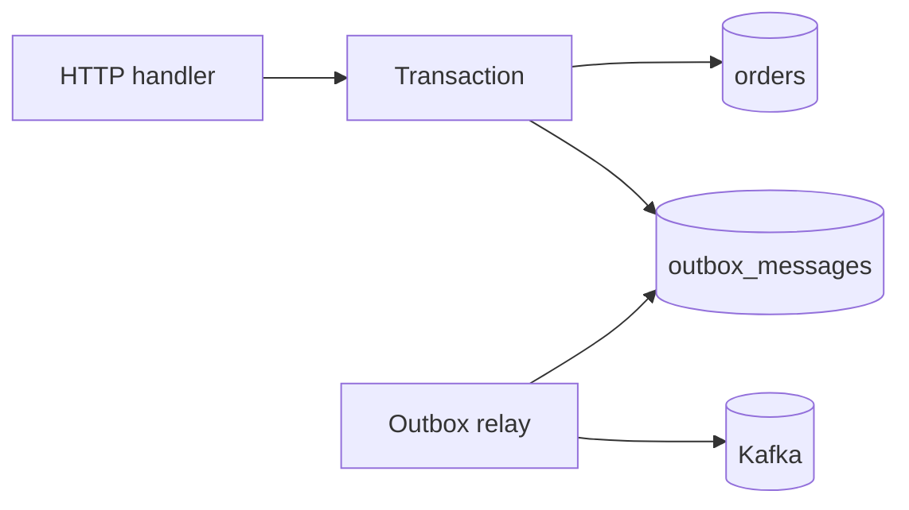
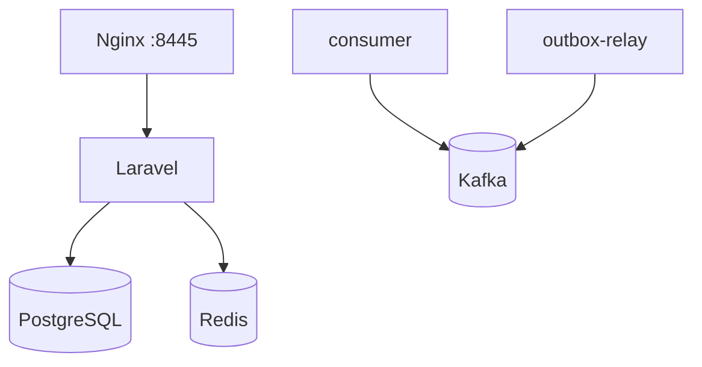

# Architecture

## Context

```mermaid
flowchart TB
  FE[Frontend checkout] --> GW[Auth gateway]
  GW --> ORD[Order API]
  ORD --> PG[(PostgreSQL)]
  ORD --> RD[(Redis)]
  ORD --> ST[Stripe]
  OUT[outbox relay] --> KF[(Kafka)]
  ORD --> OUT
  KF --> CAT[Catalog]
  KF --> NOTIF[Notification]
  KF --> AN[Analytics]
```

## Order saga (simplified)

```mermaid
sequenceDiagram
  participant Client
  participant Order
  participant Kafka
  participant Catalog
  participant Stripe

  Client->>Order: POST /orders
  Order->>Kafka: order.created
  Kafka->>Catalog: reserve
  Catalog->>Kafka: stock.reserved
  Kafka->>Order: consume
  Order->>Stripe: payment
  Stripe->>Order: webhook
  Order->>Kafka: order.paid, order.confirmed
```

## Outbox

```mermaid
flowchart LR
  API[HTTP handler] --> TX[Transaction]
  TX --> orders[(orders)]
  TX --> outbox[(outbox_messages)]
  relay[Outbox relay] --> outbox
  relay --> KF[(Kafka)]
```

## Runtime

```mermaid
flowchart TB
  nginx[Nginx :8445] --> back[Laravel]
  back --> sql[(PostgreSQL)]
  back --> redis[(Redis)]
  consumer[consumer] --> kafka[(Kafka)]
  outbox[outbox-relay] --> kafka
```
