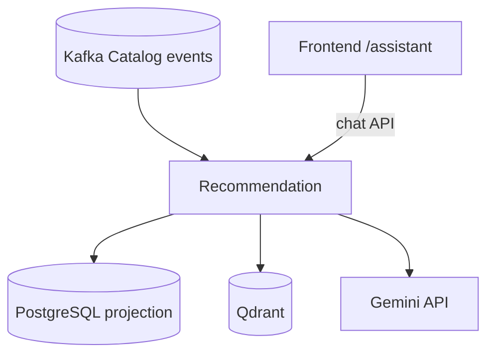
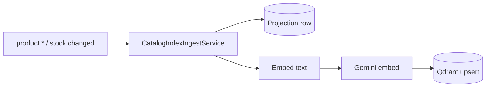
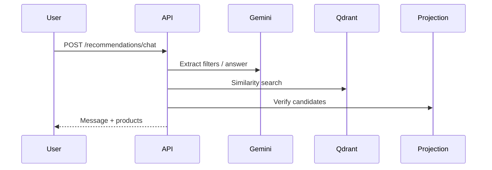
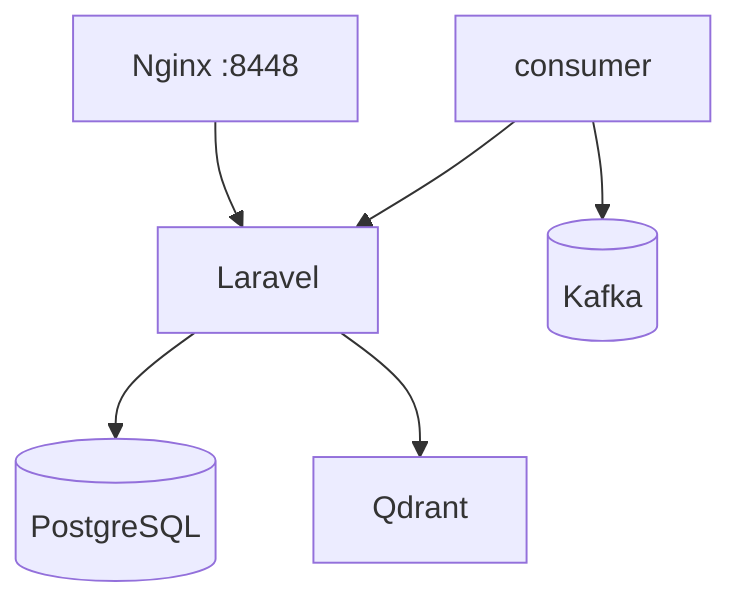

# Architecture

## Context

```mermaid
flowchart TB
  KF[(Kafka Catalog events)]
  REC[Recommendation]
  PG[(PostgreSQL projection)]
  QD[(Qdrant)]
  GEM[Gemini API]
  FE[Frontend /assistant]

  KF --> REC
  REC --> PG
  REC --> QD
  REC --> GEM
  FE -->|chat API| REC
```

## Indexing path

```mermaid
flowchart LR
  E[product.* / stock.changed] --> ING[CatalogIndexIngestService]
  ING --> PG[(Projection row)]
  ING --> EMB[Embed text]
  EMB --> GEM[Gemini embed]
  GEM --> QD[(Qdrant upsert)]
```

## Chat path

```mermaid
sequenceDiagram
  participant User
  participant API
  participant LLM as Gemini
  participant QD as Qdrant
  participant PG as Projection

  User->>API: POST /recommendations/chat
  API->>LLM: Extract filters / answer
  API->>QD: Similarity search
  API->>PG: Verify candidates
  API-->>User: Message + products
```

## Runtime

```mermaid
flowchart TB
  nginx[Nginx :8448] --> back[Laravel]
  back --> pg[(PostgreSQL)]
  back --> qdrant[Qdrant]
  consumer[consumer] --> kafka[(Kafka)]
  consumer --> back
```
