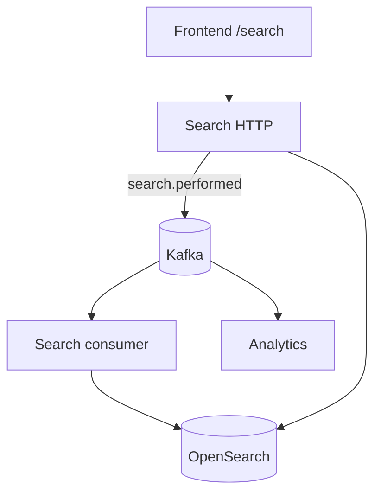
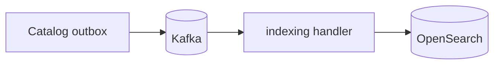
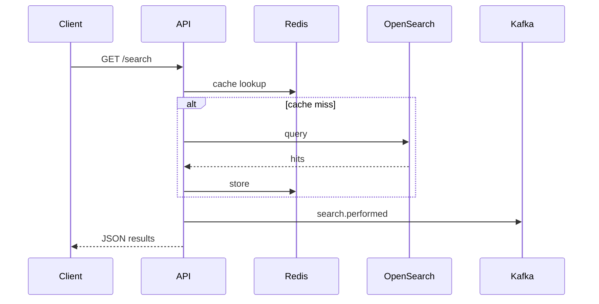
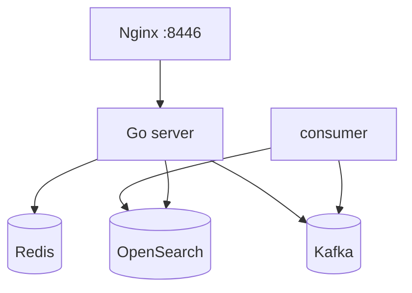

# Architecture

## Context

```mermaid
flowchart TB
  KF[(Kafka)]
  CON[Search consumer]
  OS[(OpenSearch)]
  API[Search HTTP]
  FE[Frontend /search]
  AN[Analytics]

  KF --> CON --> OS
  FE --> API --> OS
  API -->|search.performed| KF
  KF --> AN
```

## Indexing

```mermaid
flowchart LR
  CAT[Catalog outbox] --> KF[(Kafka)]
  KF --> IDX[indexing handler]
  IDX --> OS[(OpenSearch)]
```

## Search request

```mermaid
sequenceDiagram
  participant Client
  participant API
  participant Redis
  participant OS as OpenSearch
  participant Kafka

  Client->>API: GET /search
  API->>Redis: cache lookup
  alt cache miss
    API->>OS: query
    OS-->>API: hits
    API->>Redis: store
  end
  API->>Kafka: search.performed
  API-->>Client: JSON results
```

## Runtime

```mermaid
flowchart TB
  nginx[Nginx :8446] --> back[Go server]
  back --> os[(OpenSearch)]
  back --> redis[(Redis)]
  consumer[consumer] --> kafka[(Kafka)]
  consumer --> os
  back --> kafka
```
